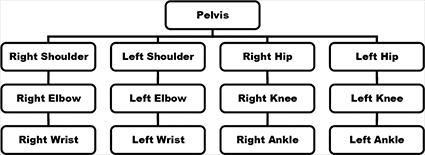

# 实验1：实现火柴人走路动作

> 姓名：王泽宇
>
> 学号：201905130196
>
> E-mail：wangzeyujiuyi@qq.com

### 实验要求

本实验要求实现层次结构, 实现一个火柴人的走路动作。要求至少要在实验中画出火柴人的如下结构:



层次结构建模适用于机器人等应用程序，其中对象的动态行为由模型各部分之间的关系来表征。 我们可以用图抽象和直观地表示模型各部分之间的关系。 在数学上，图由一组节点（或多个顶点）和一组边组成。 边连接一对节点，或将一个节点与其自身相连。边也可以具有方向。这里使用的最重要的图的类型是树，用来表示物理模型关系。

### 实验环境

Windos10，OpenGL 3.3

### 实现效果及展示

1. 在OpenGL核心模式下，使用GLSL编写顶点着色器和片段着色器。
2. 实现Camera。支持视角变动（鼠标控制）、位置移动（键盘控制）。
2. 实现纹理导入。
4. 实现Phong模型并使用单个点光源、镜面光贴图和漫反射贴图完成模型绘制。
5. 使用层次树结构完成火柴人层次结构的搭建和走路运动的实现
演示视频：[实验1演示视频](实验1演示视频.mp4)

### 核心代码及分析
##### Box类
> 相关文件：Box.h，Box.cpp

Box类封装了立方体的绘制方法，并实现了相关纹理贴图的读取。与实验 0中的Mesh.h有相似之处。

Box类存储了专属于该箱体的Model变换矩阵。并实现了相关读取、设置函数，以及各类变换的设置。

##### Node类
> 相关文件：Node.h， Node.cpp
> 
每个Node类包含一个Box，并实现了其绘制和相关设置函数。除此之外，Node类还记录了其儿子的情况。在绘制过程中，通过递归调用的方法绘制其儿子结点。其儿子结点的变换矩阵乘以其祖先结点的变换矩阵。
```c++
void Node::draw(Node* now, glm::mat4 modelPre, Shader& shader)
{
	if (now == nullptr) return;
	glm::mat4 modelNow = modelPre * now->box.getModel().getCompositeExceptZoom();
	for (auto next : now->child)
	{
		draw(next, modelNow, shader);
	}
	now->box.setModelMat4(modelNow * now->box.getModel().getZoom());
	now->box.draw(shader);	

	return;
}
```
##### 运动的实现
> 相关文件：main.cpp

在main中，我们通过scale变换生成了不同大小的箱体，并将其传递给Node节点。之后，设置Node节点的父子关系。在绘制的过程中，调用根节点（头部）的绘制函数进行绘制。层次结构与实验要求极为类似。唯一不同的是，Pelvix节点被替换成了head节点和body节点，由head节点作为根节点，head节点指向body节点，body节点指向四肢。

为了实现平滑运动，我们动过设置各个肢体的摆动幅度，进行与时间相关的差值来完成行走动作。之后通过数学推导对head节点进行旋转和平移，使得火柴人可以绕圆心旋转。


