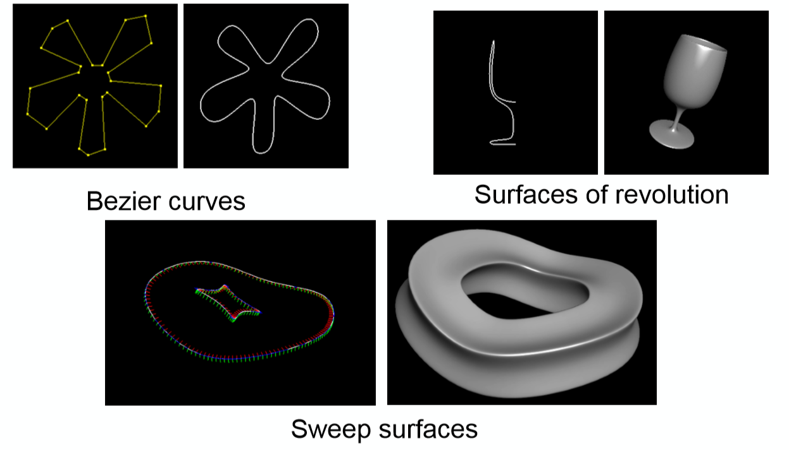

# 实验3：形状绘制

> 姓名：王泽宇
>
> 学号：201905130196
>
> E-mail：wangzeyujiuyi@qq.com

### 实验要求

本次实验的内容主要为：绘制下面三种形状。

1. 贝塞尔曲线的绘制

2. Surfaces of revolution

3. Sweep Surfaces

    

### 实验环境

Windos10

### 实现效果及展示

1. 实现绘制三阶Bezier曲线。[Bezier曲线演示视频](Bezier曲线演示视频.mp4)
2. 实现旋转体绘制。[旋转体演示视频](旋转体演示视频.mp4)
3. 实现扫掠曲面绘制。[扫掠曲面演示视频](扫掠曲面演示视频.mp4)

### 核心代码及分析

##### Bezier曲线绘制

> 相关文件：experiment3_bezier/main.cpp

通过鼠标处理函数确定定点坐标，使用OenGL提供的求值器计算并绘制Bezier曲线。每四个点绘制一次。相邻两次绘制有一个相同的端点。
```c++
//绘制Bezier曲线
        if (tot >= 4)
        {
            for (int begin = 0; begin + 3 < tot; begin += 3)
            {
                //begin,begin+3为端点，begin+1，begin+2为控制点
                glMap1f(GL_MAP1_VERTEX_3, 0.0, 1.0, 3, 4, &points[begin][0]);
                glEnable(GL_MAP1_VERTEX_3);
                glColor3f(0.0, 0.0, 1.0f);
                glLineWidth(2.0);
                glMapGrid1f(100, 0.0, 1.0);
                glEvalMesh1(GL_LINE, 0, 100);
            }
        }
```

##### 旋转体绘制
> 相关文件：experiment_revolution/main.cpp

基本思想是通过旋转定点，根据两次旋转之间的顶点绘制三角面片，不断旋转，转完180度后即可绘制完成旋转体。

```c++
//绘制
            glColor3f(0.0f, 0.0f, 1.0f);
            for (GLint i = 0; i < tot; ++i)
            {
                glBegin(GL_TRIANGLE_STRIP);

                for (GLint j = 0; j <= eps; ++j)
                {
                    GLfloat radian = 2.0 * pi * j / eps;
                    glVertex3f(points[i][0] * cos(radian), points[i][1], points[i][0] * sin(radian));
                    glVertex3f(points[i + 1][0] * cos(radian), points[i + 1][1], points[i + 1][0] * sin(radian));

                }

                glEnd();
            }
```
#####扫掠曲面绘制
> 相关文件：experiment_sweep/main.cpp

基本思路与旋转体有些类似，都是通过三角形进行绘制。扫掠曲面输入两个点集，通过对两个点集的计算，通过一定的数学推导得到它们之间的三角面片位置关系，绘制相应定点并形成三角面片。
```c++
//绘制
            glColor3f(0.0f, 0.0f, 1.0f);
            for (int i = 0; i < tot1; ++i)
            {
                glBegin(GL_TRIANGLE_STRIP);
                for (int j = 0; j < tot2; ++j)
                {
                    int nxt = (i + 1) % tot1;
                    GLfloat radian1 = atan2(points1[i][1], points1[i][0]);
                    GLfloat radian2 = atan2(points1[nxt][1], points1[nxt][0]);
                    glVertex3f(points1[i][0] + cos(radian1) * points2[j][0], points2[j][1], points1[i][1] + points2[j][0] * sin(radian1));
                    glVertex3f(points1[nxt][0] + cos(radian2) * points2[j][0], points2[j][1], points1[nxt][1] + points2[j][0] * sin(radian2));
                }
                glEnd();
            }
```